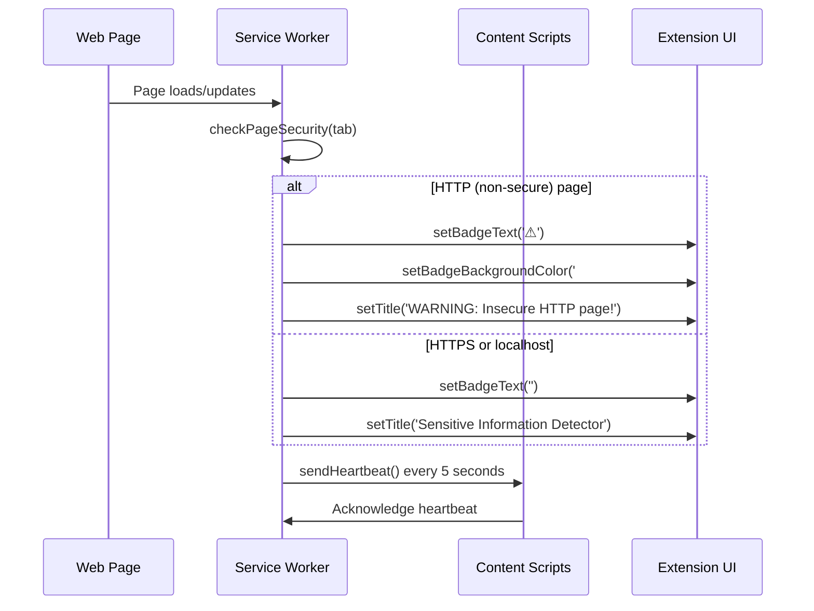
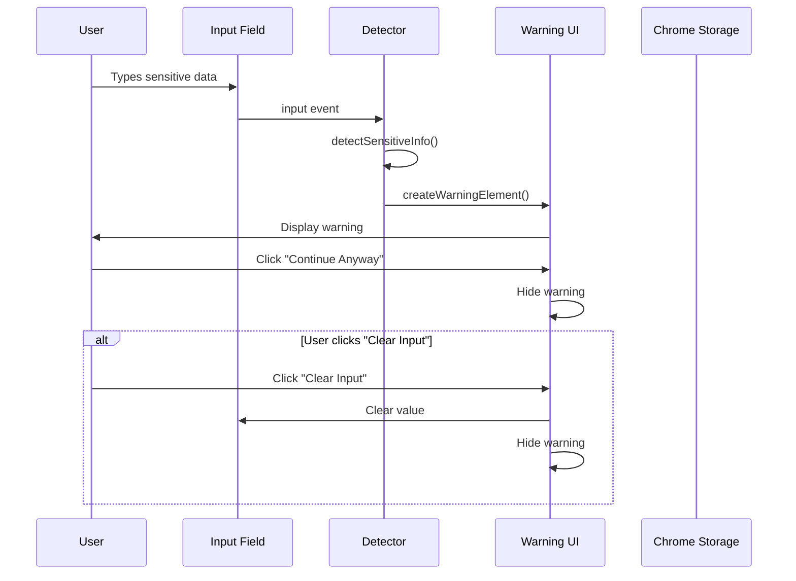
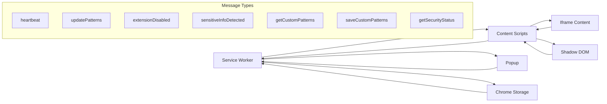
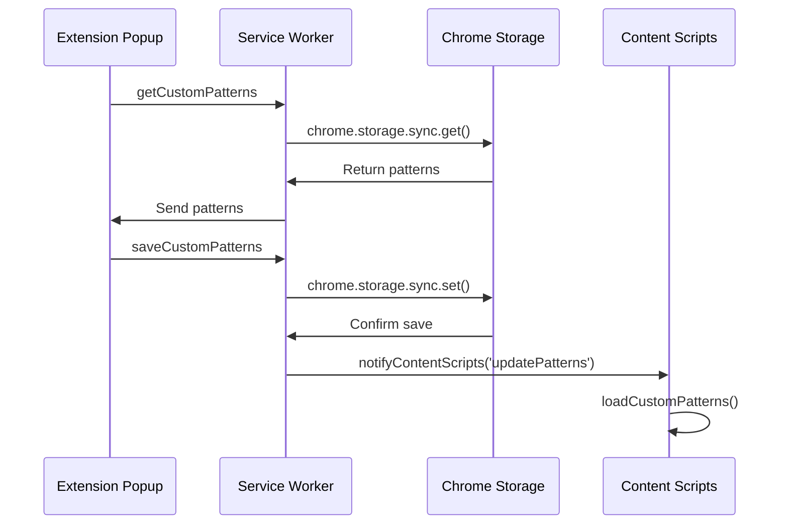
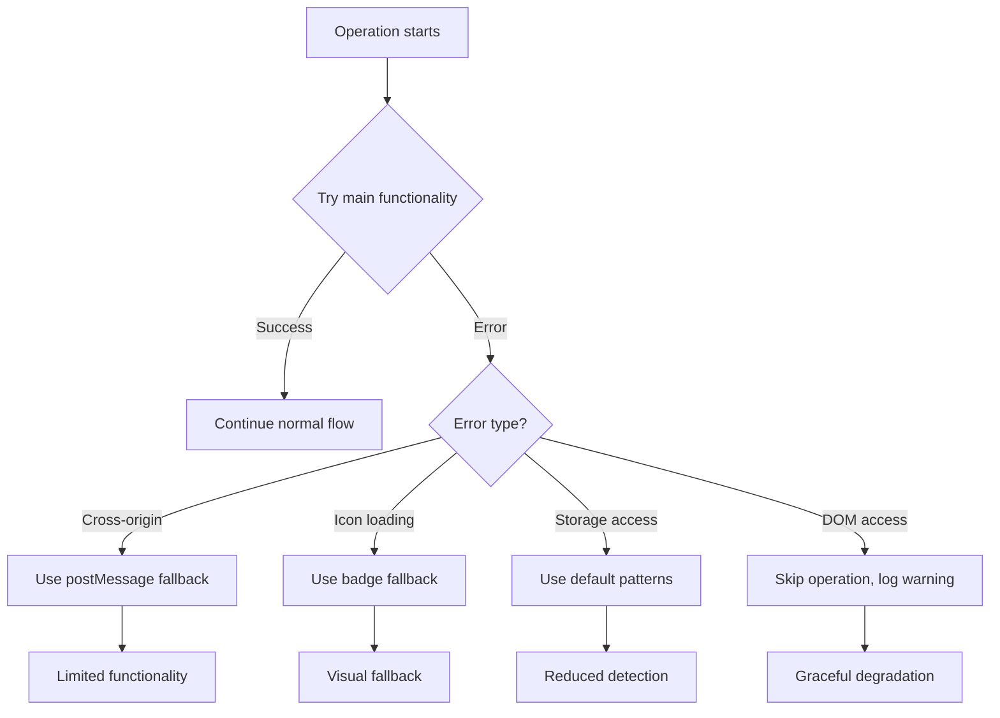

# Sensitive Information Detector - Extension Call Flow

## Overview
This document describes the complete call flow for the Sensitive Information Detector Chrome Extension, showing how different components interact with each other.

---

## 1. Extension Initialization Flow

```mermaid
graph TD
    A[Extension Install/Startup] --> B[manifest.json loads]
    B --> C[Service Worker starts]
    B --> D[Content Scripts inject into pages]
    
    C --> E[ExtensionMonitor.init()]
    E --> F[setupHeartbeat()]
    E --> G[setupStorageSync()]
    E --> H[setupTabListeners()]
    E --> I[setupManagementListeners()]
    E --> J[setupAlarms()]
    
    D --> K[detector.js loads]
    D --> L[iframe-scanner.js loads]
    D --> M[shadow-dom-scanner.js loads]
    
    K --> N[SensitiveInfoDetectionUtil creates]
    N --> O[Load custom patterns from storage]
    K --> P[SensitiveInfoDetector creates]
    P --> Q[Inject warning.css]
    P --> R[Setup event listeners]
    P --> S[Scan existing inputs]
    P --> T[Observe new elements]
    
    L --> U[IframeScanner creates]
    U --> V[Wait for SensitiveInfoDetectionUtil]
    V --> W[Scan existing iframes]
    V --> X[Observe new iframes]
    
    M --> Y[ShadowDOMScanner creates]
    Y --> Z[Wait for SensitiveInfoDetectionUtil]
    Z --> AA[Scan existing shadow DOMs]
    Z --> BB[Observe new shadow DOMs]
```

---

## 2. Page Load and Security Check Flow



---

## 3. Sensitive Information Detection Flow

### 3.1 Main Document Detection

```mermaid
graph TD
    A[User interacts with input] --> B{Input event type?}
    
    B -->|input| C[handleInput()]
    B -->|paste| D[handlePaste()]
    B -->|focus| E[handleFocus()]
    B -->|blur| F[handleBlur()]
    
    C --> G[scanInput()]
    D --> G
    E --> G
    F --> H[removeWarning()]
    
    G --> I[detectionUtil.detectSensitiveInfo()]
    I --> J[Check built-in patterns]
    I --> K[Check custom patterns]
    
    J --> L{Sensitive data found?}
    K --> L
    
    L -->|Yes| M{Is HTTPS?}
    L -->|No| N[No action]
    
    M -->|No| O[showWarning()]
    M -->|Yes| N
    
    O --> P[detectionUtil.createWarningElement()]
    P --> Q[Position warning]
    Q --> R[Add event listeners]
    R --> S[Display warning]
```

### 3.2 Shadow DOM Detection

```mermaid
graph TD
    A[Shadow DOM detected] --> B[shadowDOMScanner.scanShadowRoot()]
    B --> C[Inject warning.css into shadow root]
    C --> D[Setup event listeners in shadow DOM]
    D --> E[Scan existing inputs in shadow]
    
    E --> F[User input in shadow DOM]
    F --> G[detectSensitiveInfo()]
    G --> H{Sensitive data + HTTP?}
    
    H -->|Yes| I[showShadowWarning()]
    H -->|No| J[No action]
    
    I --> K[detectionUtil.createWarningElement(context='shadow')]
    K --> L[Position relative to shadow host]
    L --> M[Inject into shadow root]
    M --> N[Add button event listeners]
```

### 3.3 Iframe Detection

```mermaid
graph TD
    A[Iframe detected] --> B{Iframe type?}
    
    B -->|Same-origin| C[injectDetectorIntoIframe()]
    B -->|data: URL| D[scanDataUrlIframe()]
    B -->|Cross-origin| E[setupCrossOriginIframeScanning()]
    
    C --> F[injectIframeStyles()]
    D --> F
    F --> G[setupIframeDetection()]
    
    G --> H[Add input/paste listeners]
    G --> I[Scan existing inputs]
    G --> J[Setup mutation observer]
    
    I --> K{Sensitive data found?}
    K -->|Yes| L[showIframeWarning()]
    L --> M[detectionUtil.createWarningElement(context='iframe')]
    M --> N[Position in iframe document]
    
    E --> O[postMessage communication]
    O --> P[handleIframeSensitiveInfo()]
    P --> Q[Create overlay warning]
```

---

## 4. Warning Display and Interaction Flow



---

## 5. Cross-Component Communication Flow



---

## 6. Storage and Configuration Flow



---

## 7. Error Handling and Fallback Flow



---

## 8. Key Data Structures

### Detection Result
```javascript
{
  type: 'creditCard' | 'ssn' | 'email' | 'phone' | 'custom',
  name: 'Human readable name',
  severity: 'high' | 'medium' | 'low'
}
```

### Message Types
```javascript
// Service Worker → Content Script
{
  type: 'heartbeat',
  timestamp: number
}

{
  type: 'updatePatterns'
}

{
  type: 'extensionDisabled',
  message: string
}

// Content Script → Service Worker
{
  type: 'reportSensitiveData',
  detectedTypes: DetectionResult[],
  url: string
}

// Iframe → Parent
{
  type: 'sensitiveInfoDetected',
  detected: DetectionResult[],
  source: 'iframe'
}
```

---

## 9. Performance Considerations

- **Debouncing**: Input events are processed immediately but warnings are managed to avoid flickering
- **Lazy Loading**: Custom patterns loaded asynchronously
- **Memory Management**: Event listeners properly cleaned up, warnings auto-removed after 10 seconds
- **Mutation Observers**: Used efficiently to detect new elements without constant polling
- **Cross-frame Communication**: Minimized postMessage usage to reduce overhead

---

## 10. Security Model

1. **Content Script Isolation**: Each scanner operates independently
2. **Cross-Origin Protection**: Proper origin validation for postMessage
3. **CSP Compliance**: Styles injected via external CSS files
4. **Privilege Separation**: Service worker handles sensitive operations
5. **Data Minimization**: Only necessary data patterns stored

---

## 11. Simplified ASCII Call Flow Diagrams

### Extension Startup Flow
```
Extension Load
     |
     v
┌─────────────────┐    ┌──────────────────┐    ┌─────────────────┐
│  Service Worker │    │  Content Scripts │    │  Storage/Config │
│                 │    │                  │    │                 │
│ 1. ExtensionMon │    │ 1. detector.js   │    │ 1. Load custom  │
│ 2. Setup timers │    │ 2. iframe-scan   │    │    patterns     │
│ 3. Tab listeners│    │ 3. shadow-scan   │    │ 2. Sync changes │
│ 4. Heartbeat    │    │ 4. Event setup   │    │                 │
└─────────────────┘    └──────────────────┘    └─────────────────┘
     |                           |                       |
     v                           v                       v
┌─────────────────┐    ┌──────────────────┐    ┌─────────────────┐
│  Monitor tabs   │    │  Scan for inputs │    │  Pattern updates│
│  Check security │    │  Inject warnings │    │  notify scripts │
│  Send heartbeat │    │  Handle events   │    │                 │
└─────────────────┘    └──────────────────┘    └─────────────────┘
```

### Sensitive Data Detection Flow
```
User Input Event
     |
     v
┌─────────────────────────────────────────────────────────────┐
│                    INPUT PROCESSING                         │
│                                                             │
│  handleInput() → scanInput() → detectSensitiveInfo()        │
│       |              |               |                     │
│       v              v               v                     │
│  Event Type     Get Value      Pattern Matching            │
│  • input        • input.value   • Credit Cards             │
│  • paste        • textContent   • SSN                      │
│  • focus        • trim()        • Email                    │
│  • blur                         • Phone                    │
│                                 • Custom                   │
└─────────────────────────────────────────────────────────────┘
     |
     v
┌─────────────────────────────────────────────────────────────┐
│                   DECISION LOGIC                           │
│                                                             │
│  Is Sensitive Data Found? ──No──→ [No Action]              │
│           |                                                 │
│          Yes                                                │
│           |                                                 │
│           v                                                 │
│  Is Page HTTPS? ──Yes──→ [No Warning]                      │
│           |                                                 │
│          No                                                 │
│           |                                                 │
│           v                                                 │
│  [Show Warning]                                             │
└─────────────────────────────────────────────────────────────┘
     |
     v
┌─────────────────────────────────────────────────────────────┐
│                  WARNING DISPLAY                           │
│                                                             │
│  createWarningElement() → updateWarningContent()           │
│           |                        |                       │
│           v                        v                       │
│  • Create DOM structure   • Add context label              │
│  • Set CSS classes        • List detected types            │
│  • Position warning       • Add action buttons             │
│                                                             │
│  Context Types:                                             │
│  • 'main' → Main document                                  │
│  • 'shadow' → Shadow DOM                                   │
│  • 'iframe' → Iframe content                               │
└─────────────────────────────────────────────────────────────┘
```

### Cross-Context Communication
```
┌─────────────────┐    ┌─────────────────┐    ┌─────────────────┐
│   Main Document │    │   Shadow DOM    │    │     Iframe      │
│                 │    │                 │    │                 │
│ detector.js     │    │ shadow-dom-     │    │ iframe-scanner  │
│ • Input scan    │    │ scanner.js      │    │ .js             │
│ • Warning UI    │    │ • Shadow scan   │    │ • Cross-origin  │
│ • Event handle  │    │ • Inject styles │    │ • postMessage   │
│                 │    │ • Position warn │    │ • data: URLs    │
└─────────────────┘    └─────────────────┘    └─────────────────┘
         |                       |                       |
         v                       v                       v
┌─────────────────────────────────────────────────────────────┐
│              SHARED DETECTION UTILITY                      │
│                                                             │
│  SensitiveInfoDetectionUtil (detector.js)                  │
│  • detectSensitiveInfo()                                   │
│  • createWarningElement()                                  │
│  • updateWarningContent()                                  │
│  • isInputElement()                                        │
│                                                             │
│  Available globally: window.SensitiveInfoDetectionUtil     │
└─────────────────────────────────────────────────────────────┘
```

### Service Worker Monitoring
```
Service Worker (Background)
     |
     ├── Every 5 seconds ──→ Send Heartbeat to Active Tabs
     |                           |
     |                           └──→ Content Scripts Respond
     |
     ├── Tab Changes ──→ Check Page Security
     |                           |
     |                           ├── HTTP Page ──→ Show Warning Badge
     |                           └── HTTPS Page ──→ Normal Badge
     |
     ├── Storage Changes ──→ Notify Content Scripts
     |                           |
     |                           └──→ Update Custom Patterns
     |
     └── Extension Disable ──→ Warn All Tabs
                           |
                           └──→ Show Disable Warning
```

### Error Handling Strategy
```
Operation Attempt
     |
     v
┌─────────────────────────────────────────────────────────────┐
│                    TRY OPERATION                            │
└─────────────────────────────────────────────────────────────┘
     |
     v
┌─────────────────────────────────────────────────────────────┐
│  SUCCESS? ──Yes──→ [Continue Normal Flow]                   │
│     |                                                       │
│    No                                                       │
│     |                                                       │
│     v                                                       │
│  ERROR TYPE:                                                │
│  ├── Cross-Origin ──→ Use postMessage fallback             │
│  ├── File Access ──→ Use badge instead of icon             │
│  ├── DOM Access ──→ Skip operation, log warning            │
│  ├── Storage ──→ Use default patterns                      │
│  └── Unknown ──→ Graceful degradation                      │
└─────────────────────────────────────────────────────────────┘
```

---
